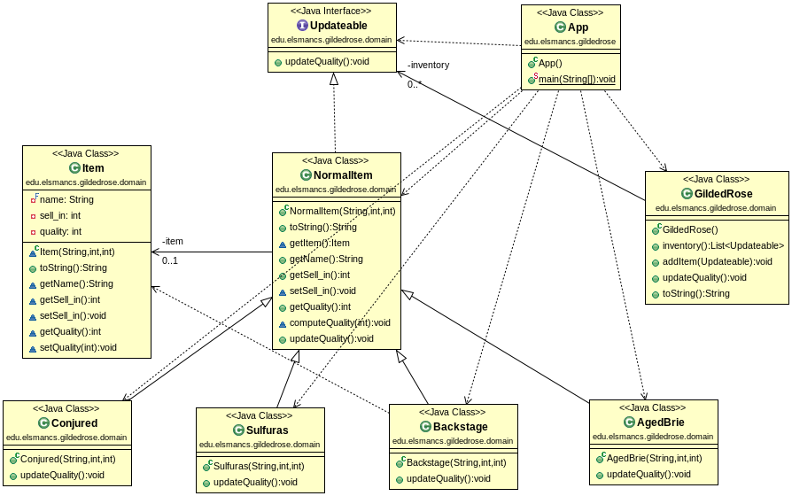

Gilded Rose kata
================

El código a refactorizar:

[Emily Bache Gilded Rose Kata - Java](https://github.com/emilybache/GildedRose-Refactoring-Kata/tree/master/Java)

La lógica del negocio:

[Cómo se actualiza la calidad de los items y su fechas de caducidad](https://github.com/dfleta/Python_ejercicios/blob/master/Poo/GildedRose_Refactoring_TDD_Kata/GildedRoseRequirements.txt)

## Cómo refactorizar

En el capítulo 24 del libro _Code Complete_ de Steven C. McConnell encontrarás todas las buenas prácticas que necesitas conocer para refactorizar de manera sistemática. 

## Qué es la refactorización

Martin Fowler define la técnica de refactorización como:

_"a change made to the internal structure of the software to make it easier to understand and cheaper to modify without changing its observable behavior”._

Es, sin duda, la frase que aprendida de memoria más salud y felicidad reportará a tu vida.

En el caso de la refactorización de la lógica de los productos mágicos de la tienda _Gilded Rose_, según las directrices de _Code Complete_:

 - _"Replace conditionals with polymorphism (especially repeated case statements):_
    - _Much of the logic that used to be contained in case statements in structured programs can instead be baked into the inheritance hierarchy and accomplished through polymorphic routine calls instead."_

 - A big refactoring is a recipe for disaster. —Kent Beck  :slack_call: @Elmo 

Es decir: para evitar la complejidad provocada por `if-else` anidados y sus correspondientes operadores lógicos vamos a utilizar polimorfismo o el **Principio de Substitución de Liskov (LSP)**(es una mujer, listo) de los principios SOLID.

Además, practicaremos TDD añadiendo poco a poco casos test para evitar etapas demasiado grandes de refactorizaciones que nos aboquen a un desastre. 

## Programación Orientada a Objetos

### Conceptos de Programación Orientada a Objetos:

Cap. 1 libro _Beginning Java 8 Fundamentals_.

- **Abstracción**: exponer sólo los detalles esenciales.
- **Encapsulamiento**: agrupar datos + las operaciones sobre esos datos => DAT o tipo de dato abstracto (Data Abstract Type).
- **Herencia**: derivar un DAT de otro, por ejemplo, el xenomorpho de la película _Alien_ (buen spoiler).
- **Ocultar información**: ocultar detalles de implementación que pueden cambiar.
- **Polimorfismo**: una entidad soporta diferentes significados en diferentes contextos.
  - **Coercitivo**: cast de tipos.
  - **De inclusión**: herencia y sobreescritura (de métodos)
  - **De sobrecarga** (de métodos).
  - **Paramétrico**: generics de Java. :mrmeeseeks: Mr. Meeseeks!

### DAT

Capítulo 6: Working Classes, Code Complete:
https://docs.google.com/document/d/1qFJXxEiWWgJPYbPghdB1d6O9TTbNmb3l85VWs-NNDfk

### LSP - SOLID

Vamos a aplicar polimorfismo o el **Principio de Substitución de Liskov (LSP)**(es una mujer, listo) de los principios SOLID.

L de SOLID = [Principio de Substitución de Liksov](https://es.wikipedia.org/wiki/Principio_de_sustituci%C3%B3n_de_Liskov)

_"Un tipo de dato abstracto se implementa escribiendo una clase especial de programa que define el tipo en términos de las operaciones que pueden ser realizadas sobre él"_. Esta es la interpretación **_duck typing_**.

_"Los subtipos deben ser substituibles por sus tipos básicos"_. Martin C. Robert.

_"Se acepta normalmente que los objetos deben ser modificados unicamente a través de sus métodos (Encapsulamiento). Como los subtipos pueden introducir nuevos métodos, ausentes en el supertipo, estos podrían cambiar el estado interno del objeto en formas que serían imposibles o inadmisibles en el supertipo. La restricción histórica impide este tipo de modificaciones."_

## Diagrama de clase UML

Utiliza este diagrama de clases UML para guiarte en la implementación de las clases:

Básicamente, es el mismo diseño que entre todas las personas de clase hemos discurrido de manera colaborativa:

